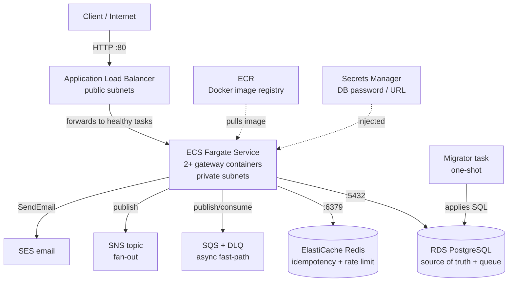
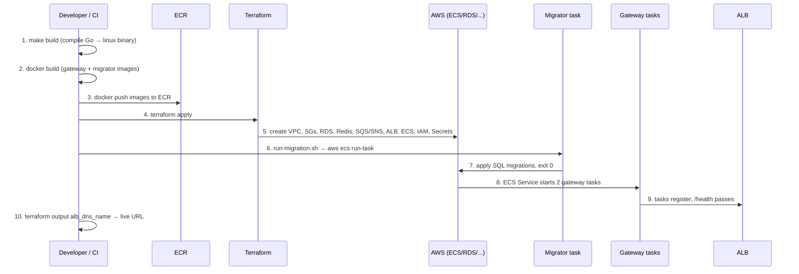

# Nimbus — Deployment & AWS Internals

A **beginner-friendly, interview-ready** guide to how Nimbus runs in the cloud. The
[Internals](INTERNALS.md) doc explains how the *code* works; this doc explains how that code gets
**packaged, shipped, and run on AWS** — and crucially **why each AWS service was chosen** over the
alternatives.

It assumes you can read a little YAML/HCL but does **not** assume you already know what ECS, Fargate,
an ALB, a VPC, or a NAT gateway is. Every one of those is explained from scratch the first time it
appears.

> **How to read this for an interview:** go top-to-bottom once to build the mental model, then
> memorize the **one-paragraph "elevator pitch"** in §1 and the **deployment flow** in §10. Every
> service section ends with a **Why / Alternatives / Tradeoff** block — those are exactly the
> follow-up questions an SDE2/SDE3 interviewer will ask.

---

## Table of Contents

1. [The one idea: what "deploying Nimbus" actually means](#1-the-one-idea-what-deploying-nimbus-actually-means)
2. [The 30-second mental map](#2-the-30-second-mental-map)
3. [Infrastructure as Code — what Terraform is and why](#3-infrastructure-as-code--what-terraform-is-and-why)
4. [The network layer: VPC, subnets, NAT, security groups](#4-the-network-layer-vpc-subnets-nat-security-groups)
5. [The compute layer: ECR, ECS, Fargate, the task definition](#5-the-compute-layer-ecr-ecs-fargate-the-task-definition)
6. [The traffic layer: ALB, target groups, health checks](#6-the-traffic-layer-alb-target-groups-health-checks)
7. [The data layer: RDS, ElastiCache, SQS/SNS](#7-the-data-layer-rds-elasticache-sqssns)
8. [Secrets & permissions: Secrets Manager + IAM roles](#8-secrets--permissions-secrets-manager--iam-roles)
9. [Database migrations: the one-shot migrator task](#9-database-migrations-the-one-shot-migrator-task)
10. [The full deployment flow, end to end](#10-the-full-deployment-flow-end-to-end)
11. [Resilience: how the system survives failures](#11-resilience-how-the-system-survives-failures)
12. [The big tradeoffs, consolidated (interview cheat sheet)](#12-the-big-tradeoffs-consolidated-interview-cheat-sheet)
13. [Likely interview questions & crisp answers](#13-likely-interview-questions--crisp-answers)

---

## 1. The one idea: what "deploying Nimbus" actually means

If you remember nothing else, remember this sentence:

> **We package the Go app into a Docker image, store it in ECR, and AWS Fargate runs copies of that
> image as containers behind a load balancer — with Postgres, Redis, and SQS as managed backing
> services, all defined in Terraform.**

Everything below is just the detail behind that one sentence. There are **three layers**:

| Layer | Question it answers | AWS services |
|---|---|---|
| **Network** | Where does traffic flow, and what's locked down? | VPC, subnets, NAT gateway, security groups |
| **Compute** | What actually runs my code? | ECR, ECS, Fargate |
| **Data / backing** | Where does state live? | RDS (Postgres), ElastiCache (Redis), SQS, SNS, SES |

And one tool — **Terraform** — describes all of it as code so the whole thing can be created or
destroyed with one command.

---

## 2. The 30-second mental map



Read it as a sentence: *the internet hits the **ALB**, which forwards to **Fargate** containers
pulled from **ECR**; those containers talk to **RDS / Redis / SQS / SNS / SES**, reading their
password from **Secrets Manager**; a separate **migrator** sets up the database schema first.*

---

## 3. Infrastructure as Code — what Terraform is and why

**The problem.** You *could* click around the AWS console to create a database, a load balancer, a
cluster, etc. But then: how do you recreate it in another region? How does a teammate know what
exists? How do you tear it down cleanly? Clicking is unrepeatable and undocumented.

**The fix: Terraform.** You write the desired infrastructure in `.tf` files (a language called HCL),
and Terraform figures out the API calls to make AWS match that description. The files *are* the
documentation, and `terraform destroy` cleans everything up.

The three commands you must know:

| Command | What it does |
|---|---|
| `terraform plan` | Dry run — shows what *would* change. Never touches AWS. |
| `terraform apply` | Actually creates/updates resources to match the `.tf` files. |
| `terraform destroy` | Deletes everything Terraform created. |

**How Terraform tracks reality: the state file.** Terraform keeps a `terraform.tfstate` file mapping
"resource in my code" → "real thing in AWS." In Nimbus this is stored **locally** for simplicity (see
[terraform/main.tf](../terraform/main.tf)), with a commented-out **S3 backend** for team use.

The files are split by concern so each is readable on its own:

| File | Owns |
|---|---|
| [terraform/main.tf](../terraform/main.tf) | Provider, region, shared `locals` (naming) |
| [terraform/vpc.tf](../terraform/vpc.tf) | Network + security groups |
| [terraform/ecs.tf](../terraform/ecs.tf) | ECR, ECS cluster, task defs, ALB, autoscaling, IAM |
| [terraform/rds.tf](../terraform/rds.tf) | Postgres + its secrets |
| [terraform/elasticache.tf](../terraform/elasticache.tf) | Redis |
| [terraform/sqs.tf](../terraform/sqs.tf) | SQS queue, DLQ, SNS topic |
| [terraform/variables.tf](../terraform/variables.tf) | Inputs (region, sizes, counts) |
| [terraform/outputs.tf](../terraform/outputs.tf) | Values printed after apply (ALB URL, endpoints) |

> **Why / Alternatives / Tradeoff**
> **Why Terraform:** declarative, cloud-agnostic, huge community, readable diffs in `plan`.
> **Alternatives:** AWS CloudFormation (AWS-only, more verbose), AWS CDK (real code, steeper),
> Pulumi (real code), or manual console clicks (unrepeatable).
> **Tradeoff:** Terraform adds a *state file* you must protect and not corrupt — the price of having
> a single source of truth.

---

## 4. The network layer: VPC, subnets, NAT, security groups

Before any compute can run, you need a private network. This is [terraform/vpc.tf](../terraform/vpc.tf).

### VPC — your own private slice of AWS
A **VPC (Virtual Private Cloud)** is an isolated network just for your app, with its own IP range
(`10.0.0.0/16` here — ~65k addresses). Nothing else on AWS can see inside it unless you allow it.

### Subnets — public vs private (the most important distinction)
A subnet is a slice of the VPC's IP range, tied to one **Availability Zone (AZ)** — a physically
separate datacenter. Nimbus uses **two AZs** so a whole datacenter can fail and the app survives.

Each AZ gets two subnets:

- **Public subnet** → has a route to the internet. **Only the load balancer lives here.**
- **Private subnet** → no direct inbound internet route. **The app containers, database, and Redis
  live here.** This is the security win: even if someone knows your DB's address, there's no network
  path to reach it from the internet.

### NAT gateway — outbound-only internet for private things
The app in a private subnet still needs to call *out* (to SES, to pull updates). A **NAT gateway**
(in the public subnet) lets private resources make **outbound** connections while blocking all
**inbound** ones. Nimbus uses a single NAT in non-prod to save money, one-per-AZ in prod (see
[vpc.tf](../terraform/vpc.tf#L14)).

### Security groups — per-resource firewalls, chained
A **security group (SG)** is a stateful firewall attached to a resource. Nimbus chains them so each
layer only accepts traffic from the layer directly above it:

```
Internet ──(80/443)──▶ [ALB SG] ──(8080)──▶ [ECS SG] ──(5432)──▶ [RDS SG]
                                              └────────(6379)──▶ [Redis SG]
```

The RDS security group's ingress rule literally says "only allow port 5432 *from the ECS security
group*" — not from an IP range. So the database is reachable **only** by the app. (See
[vpc.tf](../terraform/vpc.tf#L70).)

> **Why / Alternatives / Tradeoff**
> **Why this layout:** defense in depth — even a leaked DB password is useless without network access.
> **Alternative:** put everything in public subnets with strict SGs (simpler, but one misconfigured
> rule exposes your DB to the world).
> **Tradeoff:** NAT gateways cost money and the two-AZ setup doubles some resources — you pay for
> availability and isolation.

---

## 5. The compute layer: ECR, ECS, Fargate, the task definition

This is the heart of "where my code runs" — all in [terraform/ecs.tf](../terraform/ecs.tf).

### ECR — the image registry
**ECR (Elastic Container Registry)** is AWS's private Docker Hub. You build the Go app into a Docker
image and `docker push` it here. Nimbus has **two** repos — one for the `gateway` app, one for the
`migrator` — and a lifecycle policy that keeps only the **last 10 images** so storage doesn't grow
forever ([ecs.tf](../terraform/ecs.tf#L2)).

### ECS — the orchestrator
**ECS (Elastic Container Service)** is the brain that decides *which* containers run, *how many*, and
restarts them when they die. Three nouns you must keep straight:

| Term | Plain meaning | Analogy |
|---|---|---|
| **Task definition** | A recipe: which image, how much CPU/RAM, env vars, ports | A class |
| **Task** | One running container from that recipe | An object/instance |
| **Service** | "Keep N tasks running forever, replace dead ones" | A supervisor |

### Fargate — serverless containers (no servers to manage)
Normally ECS runs your containers on **EC2 virtual machines you have to patch and scale**. **Fargate**
removes that: you just say "run this task with 0.25 vCPU and 512 MB," and AWS finds the hardware.
**No servers to manage.** Nimbus runs `launch_type = "FARGATE"` ([ecs.tf](../terraform/ecs.tf#L335)).

### The task definition, decoded
The `gateway` task definition ([ecs.tf](../terraform/ecs.tf#L213)) is the recipe AWS uses:

- **image** → `…ecr…/nimbus-prod:latest` (pulled from ECR).
- **cpu / memory** → 256 CPU units (0.25 vCPU) / 512 MB by default ([variables.tf](../terraform/variables.tf#L43)).
- **portMappings** → exposes container port **8080**.
- **environment** → plain config wired straight from other resources: `DB_HOST` = the RDS address,
  `REDIS_HOST` = the ElastiCache endpoint, `SQS_QUEUE_URL`, `SNS_TOPIC_ARN`, etc. Terraform fills
  these in automatically because the resources reference each other.
- **secrets** → `DB_PASSWORD` and `DATABASE_URL` are **not** in plaintext; they're pulled from
  Secrets Manager at container start (see §8).
- **logConfiguration** → ships stdout to a **CloudWatch** log group `/ecs/nimbus-prod`.
- **healthCheck** → container runs `wget /health`; if it fails 3× the task is killed and replaced.

### The Service & autoscaling — staying alive and elastic
The **ECS Service** ([ecs.tf](../terraform/ecs.tf#L335)) keeps `desired_count = 2` tasks running in
the **private** subnets, registers them with the load balancer, and replaces any that die.

**Autoscaling** ([ecs.tf](../terraform/ecs.tf#L373)) adds a target-tracking policy: keep average CPU
at **70%**, scaling between **2 and 10** tasks. Traffic spike → more containers; quiet → scale back in.

> **Why / Alternatives / Tradeoff**
> **Why ECS + Fargate:** no servers to patch, built-in autoscaling and health management, cheap for
> a small fleet, simplest path from "Docker image" to "running in prod."
> **Alternatives:** **EKS/Kubernetes** (far more powerful and portable, but heavy operational
> overhead — overkill here), **EC2 + ECS** (cheaper at huge scale but you manage the VMs), **Lambda**
> (great for spiky/short work, bad for a long-running poll-loop worker).
> **Tradeoff:** Fargate costs a bit more per vCPU-hour than raw EC2 — you pay for not managing servers.

---

## 6. The traffic layer: ALB, target groups, health checks

How does a user's request actually reach one of the containers? Via the **Application Load Balancer
(ALB)** ([ecs.tf](../terraform/ecs.tf#L300)).

- The **ALB** sits in the **public** subnets and is the single internet-facing entry point. It listens
  on **port 80** and forwards to a **target group**.
- A **target group** is the list of healthy containers to send traffic to. It health-checks each task
  by hitting `/health` every 30s; unhealthy tasks are removed from rotation automatically.
- Because tasks come and go (autoscaling, restarts), the target group uses `target_type = "ip"` and
  ECS registers/deregisters task IPs as they change — you never manage the list by hand.

So the path is: **Internet → ALB (:80, public) → Target Group → healthy Fargate task (:8080,
private).** The ALB is also what makes running *multiple* containers useful: it spreads load across
all healthy tasks.

> **Why / Alternatives / Tradeoff**
> **Why an ALB:** Layer-7 (HTTP-aware) routing, automatic health checks, integrates natively with
> ECS, terminates TLS, supports path-based routing for future services.
> **Alternatives:** **NLB** (Layer-4, faster but no HTTP smarts), **API Gateway** (great for
> serverless/Lambda, more expensive per request), or exposing tasks directly (no health management,
> no single entry point).
> **Tradeoff:** the ALB is an always-on hourly cost and a single front door you must keep healthy.

---

## 7. The data layer: RDS, ElastiCache, SQS/SNS

Stateless containers are easy — they can die and restart. **State** is the hard part, so Nimbus
pushes all of it into **managed** services AWS operates for you.

### RDS PostgreSQL — the source of truth *and* the queue
[terraform/rds.tf](../terraform/rds.tf). **RDS (Relational Database Service)** is managed Postgres:
AWS handles backups, patching, failover. Key settings:

- **Encrypted at rest**, storage autoscales 20 → 100 GB.
- **`multi_az = true` only in prod** → a hot standby in a second AZ that takes over automatically if
  the primary fails. (Costs double, so non-prod skips it.)
- Lives in **private** subnets, reachable only from the ECS security group.

Remember from [INTERNALS.md](INTERNALS.md): Postgres is **both** the source of truth **and** the work
queue (the transactional outbox pattern). That's why the database is the most carefully protected
resource here.

### ElastiCache Redis — fast ephemeral state
[terraform/elasticache.tf](../terraform/elasticache.tf). **ElastiCache** is managed Redis, used for
**idempotency keys** and **per-tenant rate limiting** — data that must be read/written in
microseconds and can be rebuilt if lost. In prod it runs with **automatic failover + multi-AZ**; in
dev a single node.

### SQS + DLQ — the durable async buffer
[terraform/sqs.tf](../terraform/sqs.tf). **SQS (Simple Queue Service)** is a managed message queue.
Nimbus uses it as the optional fast-path between accepting a request and processing it:

- The main queue uses **long polling** (cheaper, fewer empty reads) and a 24-hour retention.
- A **redrive policy** sends a message to the **DLQ (Dead-Letter Queue)** after **5 failed
  deliveries**, so a single poison message can't block the queue forever. The DLQ keeps messages 14
  days so you can inspect what went wrong.

### SNS — fan-out by channel
**SNS (Simple Notification Service)** is pub/sub. The topic fans a published message out to
subscribers; Nimbus subscribes an SQS queue with a **filter policy on `channel`** (e.g. only
`email`), so the right messages land in the right queue.

> **Why / Alternatives / Tradeoff**
> **Why managed (RDS/ElastiCache/SQS):** you get backups, failover, patching, and scaling for free —
> no 3am pager for a disk-full Postgres.
> **Alternatives:** self-host Postgres/Redis/RabbitMQ on EC2 (cheaper, but you own all the ops), or
> Kafka instead of SQS (higher throughput + replay, far more to operate).
> **Tradeoff:** managed services cost more and give you less low-level control — almost always worth
> it for a small team.

---

## 8. Secrets & permissions: Secrets Manager + IAM roles

Two security questions every interviewer asks: *"Where do secrets live?"* and *"How does the app get
permission to call AWS?"*

### Secrets Manager — no passwords in code
The DB password is **generated by Terraform** (`random_password`) and stored in **AWS Secrets
Manager** ([rds.tf](../terraform/rds.tf#L11)) — never in the `.tf` files, never in the image. The task
definition references the secret's ARN, and Fargate injects the value as an env var **at container
start**. A full `DATABASE_URL` secret is also built for the migrator.

### IAM roles — least-privilege identity for the container
**IAM (Identity and Access Management)** is how AWS controls who can do what. The app doesn't use
long-lived keys; instead it *assumes a role*. There are **two** ([ecs.tf](../terraform/ecs.tf#L88)):

| Role | Used by | Allowed to |
|---|---|---|
| **Execution role** | Fargate itself | Pull the ECR image, read the two secrets, write logs |
| **Task role** | Your running app code | `sqs:SendMessage/ReceiveMessage`, `sns:Publish`, `ses:SendEmail` |

Splitting them follows **least privilege**: the platform's "start the container" permissions are
separate from the app's "do its job" permissions. The app can send email and use the queue — and
nothing else.

> **Why / Alternatives / Tradeoff**
> **Why IAM roles + Secrets Manager:** zero static credentials in the image or repo; permissions are
> auditable and revocable; secrets rotate without a redeploy.
> **Alternatives:** env-var secrets baked into the image (leaky), `.env` files (easy to commit by
> accident), SSM Parameter Store (cheaper than Secrets Manager, fewer features).
> **Tradeoff:** more moving parts and IAM policy JSON to maintain — the standard cost of doing
> security correctly.

---

## 9. Database migrations: the one-shot migrator task

A subtle but classic interview topic: **the schema must exist before the app starts, but you don't
want the app to run migrations itself** (race conditions when 2+ containers boot at once).

Nimbus solves this with a **separate, one-shot migrator**:

- Its own ECR image and its own ECS **task definition** ([ecs.tf](../terraform/ecs.tf#L373)) — tiny
  (256 CPU / 512 MB), **no service** wrapping it, so it runs once and exits.
- It reads the `DATABASE_URL` secret and applies the SQL files in `/migrations`.
- The script [terraform/run-migration.sh](../terraform/run-migration.sh) launches it with
  `aws ecs run-task`, waits for it to stop, checks the **exit code**, and tails the CloudWatch logs.
  Non-zero exit = migration failed = deploy stops.

> **Why / Alternatives / Tradeoff**
> **Why a separate task:** exactly one process touches the schema, so no migration races; it can run
> in the prod network/subnets with the right secret; clean pass/fail via exit code.
> **Alternatives:** run migrations on app startup (race conditions, slow boots), or from a developer
> laptop (needs DB exposed publicly — bad).
> **Tradeoff:** one more image and an extra deploy step to orchestrate.

---

## 10. The full deployment flow, end to end

This is the sequence to **memorize for interviews**. From source code to serving traffic:



In words, the seven beats:

1. **Build** — `make build` compiles the Go app into a static Linux binary; `docker build` wraps it
   into images for both `gateway` and `migrator` ([Makefile](../Makefile)).
2. **Push** — `docker push` uploads the images to their **ECR** repos.
3. **Provision** — `terraform apply` creates *all* infrastructure (network → data → compute) in
   dependency order. Terraform knows RDS must exist before the task definition that references its
   address.
4. **Migrate** — `run-migration.sh` launches the one-shot migrator task to set up the schema, and
   fails the deploy if it errors.
5. **Run** — the ECS **Service** pulls the `gateway` image and starts 2 tasks in the private subnets.
6. **Register & health-check** — tasks report healthy on `/health`; the ALB adds them to rotation.
7. **Serve** — the ALB's DNS name (a `terraform output`) is now the public URL; autoscaling and the
   deployment circuit breaker take over from here.

**To update the app later:** push a new image, then force a new ECS deployment. ECS does a **rolling
update** — start new tasks, wait for them to pass health checks, drain old ones — so there's no
downtime.

---

## 11. Resilience: how the system survives failures

Tie these back to specific config — interviewers love "show me where."

| Failure | What saves you | Where |
|---|---|---|
| A container crashes | ECS Service restarts it to keep `desired_count` | [ecs.tf](../terraform/ecs.tf#L335) |
| A whole AZ goes down | 2 AZs + multi-AZ RDS/Redis fail over | [vpc.tf](../terraform/vpc.tf), [rds.tf](../terraform/rds.tf) |
| A traffic spike | CPU autoscaling 2 → 10 tasks | [ecs.tf](../terraform/ecs.tf#L373) |
| A **bad deploy** | ECS **deployment circuit breaker** auto-rolls back | [ecs.tf](../terraform/ecs.tf#L355) |
| A downstream (SES/SNS) outage | **App-level circuit breakers** fail fast | [INTERNALS.md](INTERNALS.md) §7 |
| A poison message | SQS **DLQ** after 5 retries | [sqs.tf](../terraform/sqs.tf) |
| A leaked DB password | Network isolation — DB only reachable from ECS SG | [vpc.tf](../terraform/vpc.tf#L70) |

> **Two different "circuit breakers" — don't confuse them in an interview:**
> - **ECS deployment circuit breaker** = infra-level; rolls back a *deploy* if new tasks won't go
>   healthy.
> - **App-level circuit breaker** (in the Go code) = runtime; stops calling a *downstream service*
>   (SES/SNS/webhook) that's failing. See [INTERNALS.md](INTERNALS.md).

---

## 12. The big tradeoffs, consolidated (interview cheat sheet)

| Decision | Chose | Over | Because |
|---|---|---|---|
| IaC tool | Terraform | CloudFormation / console | Declarative, portable, readable diffs |
| Compute | ECS + Fargate | Kubernetes / EC2 / Lambda | No servers to manage; right size for the team |
| Load balancing | ALB | NLB / API Gateway | HTTP-aware, health checks, native ECS integration |
| Database | RDS Postgres | Self-hosted / DynamoDB | Managed ops + relational + outbox pattern needs SQL |
| Cache | ElastiCache Redis | Self-hosted Redis | Managed failover for ephemeral state |
| Queue | SQS + DLQ | Kafka / RabbitMQ | Fully managed, DLQ built in, low ops |
| Secrets | Secrets Manager | env vars / files | No plaintext secrets; rotation without redeploy |
| Auth to AWS | IAM roles | static access keys | No long-lived credentials; least privilege |
| Migrations | Separate one-shot task | on-startup | Avoids races across multiple containers |
| State isolation | Private subnets | public + SGs | Defense in depth |

The unifying theme: **prefer managed services and least-privilege isolation, accept higher dollar
cost in exchange for far lower operational burden and blast radius.**

---

## 13. Likely interview questions & crisp answers

**Q: Walk me through what happens when you deploy.**
Build the Go app into Docker images → push to ECR → `terraform apply` provisions network, data, and
compute → run the one-shot migrator → ECS Fargate starts gateway tasks in private subnets → they pass
`/health` and the ALB routes traffic to them.

**Q: Why Fargate over Kubernetes?**
The team is small and the workload is a straightforward web app + worker. Fargate gives autoscaling,
health management, and zero server maintenance. Kubernetes would add large operational overhead for
no benefit at this scale.

**Q: How is the database protected?**
It's in private subnets with a security group that only accepts port 5432 *from the ECS security
group*. There is no internet route to it. The password is generated by Terraform and stored in
Secrets Manager, injected at container start — never in code or the image.

**Q: How do you handle a bad deploy?**
ECS's deployment circuit breaker watches new tasks; if they fail health checks it automatically rolls
back to the previous version. Updates are rolling, so old tasks keep serving until new ones are
healthy.

**Q: How does the app scale?**
The ECS Service runs a minimum of 2 tasks across 2 AZs; a target-tracking autoscaling policy keeps CPU
around 70%, scaling up to 10 tasks under load and back down when quiet.

**Q: Where does state live, and why not in the container?**
Containers are stateless and disposable. All state is in managed services — Postgres (RDS) for the
source of truth and work queue, Redis (ElastiCache) for idempotency/rate-limit data, SQS for the
async buffer — so any container can die and be replaced with no data loss.

**Q: What's the difference between the execution role and the task role?**
The execution role is for Fargate to start the container (pull the image, read secrets, write logs).
The task role is for the running app code (publish to SNS/SQS, send via SES). Splitting them is least
privilege.

---

## Where to go next

- [INTERNALS.md](INTERNALS.md) — how the *code* works (outbox pattern, worker, circuit breakers, RAG).
- [ARCHITECTURE.md](../ARCHITECTURE_DIAGRAMS.md) — the system-shape diagrams.
- The Terraform files in [terraform/](../terraform/) — read them in this order: `vpc.tf` →
  `rds.tf`/`elasticache.tf`/`sqs.tf` → `ecs.tf` → `outputs.tf`.
